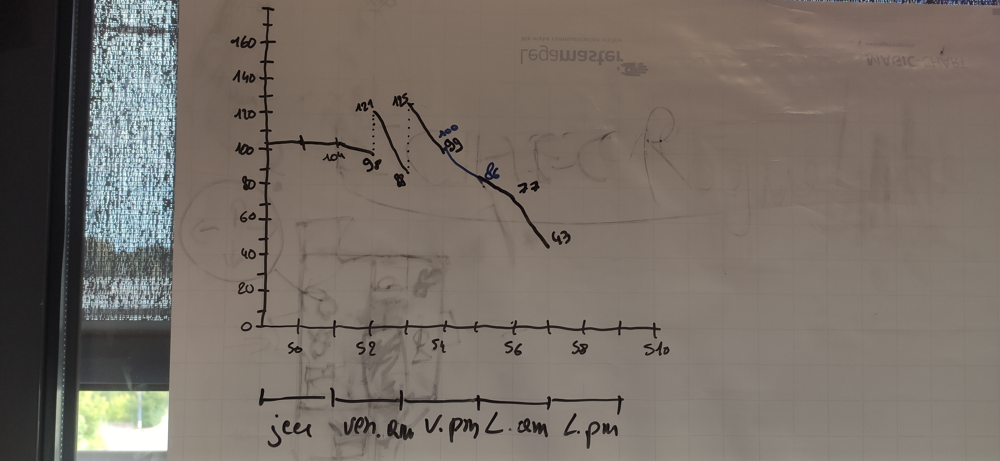

# **Mini-Projet - Méthode Agile**

---

# Sprint 0

## Trouver le jeu que vous allez fabriquer

* Au départ nous nous sommes dirigé vers un jeu d'échecs simples avec des fonctionnalités 
avancées. Mais l'idée était trop simple. Étant inspiré par le modèle rogue Like
Nous avons trouvé un entre-deux qui offre une aventure dans un univers unique à travers la mécanique des pièces d'échecs.

### Partager la vision du jeu

Notre jeu se déroule à travers 5 niveaux pour terminer face à un boss final.

Le joueur démarre son aventure en incarnant le roi. Il va croiser durant les niveaux d'autres pièces du jeu d'échecs voulant le tuer.
Il peut choisir entre les éviter pour passer au niveau suivant et atteindre le boss
où tenter de les vaincre pour qu'il rejoigne son équipe (Attention : il est fort possible que les pièces vaincues n'acceptent pas de vous rejoindre.)

N'oubliez pas que seul vous allez plus vite, mais a plusieurs, vous allez plus loin.
Mais attention Le Boss final ne va pas se laisser faire aussi facilement.

### Découper et estimer le backlog

Notre backlog se découpe en 26 tâches avec des poids différents (allant de 1 a 21 suivant le modèle de la suite de Fibonnaci)

---

# Sprint 1

## Démo + Planification du sprint suivant

### Ce que nous avons fait durant ce sprint
Durant ce sprint nous avons livré les histoires utilisateurs suivantes : 
* Permettre au joueur d'interagir avec une interface
* Lui permettre de déplacer une pièce
* Qu'il puisse attaquer les ennemis
* Que les ennemis (IA) l'attaquent en retour
* Que le jeu soit ergonomique et agréable dans ses contrôles
* Donner un But et une trame de jeu fluide au Scénario de jeu
* Créer des conditions de victoires ou de défaite pour le joueur

### Ce que nous allons faire durant le prochain sprint
* Etablir les classes des pions
* mettre en place la map
* le deplacement des pions

## Rétrospective

### Sur quoi avons nous butté ?
Lister ici tout ce qui était un peut moins bien que parfait.

**Nous avons mis trop de temps a se mettre d'accord sur la direction du projet ainsi que la manière de procéder pour le produire.**

### PDCA
* De tous ces éléments quel est celui que vous voulez améliorer ?
     * La direction du projet.
* Comment pouvez-vous mesurer qu'il s'améliore ?
     * La bonne répartition des taches et la mise en commun facile.

---

# Sprint 2

## Démo + Planification du sprint suivant

### Ce que nous avons fait durant ce sprint
Durant ce sprint nous avons livré les histoires utilisateurs suivantes : 
* Avoir un plateau
* avoir un joueur
* Afficher un joueur sur le plateau
* Déplacer le joueur basiquement
* Déplacer le joueur dans toutes les directions
* mettre des obstacles
* Avoir des cotés pas nécessairement droit

### Ce que nous allons faire durant le prochain sprint
* Differencier les déplacement de chaque type de joueur
* mettre le joueur sur un plateau et qu'il puisse se déplpacer

## Rétrospective

### Sur quoi avons nous butté ?

Utilisation chaotique du GIT

**Se mettre d'accord sur La direction a prendre dans l'architecture du projet.
Prise en main de git et de Java.**

### PDCA
* De tous ces éléments quel est celui que vous voulez améliorer ?
     * L'architecture du projet.
* Comment pouvez-vous mesurer qu'il s'améliore ?
     * Lors de la mise en commun des fonctionnalitées développés par chacun.
* Quelles sont toutes les options possible pour l'améliorer ?
     * Parler régulièrement pour savoir ou l'on se dirige.

 

---

# Sprint 3

## Démo + Planification du sprint suivant

### Ce que nous avons fait durant ce sprint
* Avoir différent types de joueurs
* mettre le joueur sur un plateau et qu'il puisse se déplacer
* Charger une map depuis un fichier
* Sélectionner un pion sur le plateau
* Sélectionner un déplacement basique (gauche / droite / haut / bas)

### Ce que nous allons faire durant le prochain sprint
* Differencier les déplacements de chaque type de joueur
* Sélectionner un déplacement basique (gauche / droite / haut / bas)
* Déplacements et choix du pion

## Rétrospective

### Sur quoi avons nous butté ?

* Communiquer d'avantage
* Mauvaise évaluations des difficultées de tâche

### PDCA
* De tous ces éléments quel est celui que vous voulez améliorer ?
     * La Mauvaise évaluations des difficultées de tâche
* Comment pouvez-vous mesurer qu'il s'améliore ?
     * Les tâches sont mieux réparties
* Quelles sont toutes les options possible pour l'améliorer ?
     * Réevaluer les poids des tâches

---

# Sprint 4

## Démo + Planification du sprint suivant

### Ce que nous avons fait durant ce sprint
* Differencier les déplacements de chaque type de joueur (début)
* Sélectionner un déplacement basique (gauche / droite / haut / bas)
* Déplacements et choix du pion
* Ajout écran d'acceuil

### Ce que nous allons faire durant le prochain sprint
* Coup possible sur la Map (affichage de tout les coups possibles)
* Finir de différencier les déplacements de chaque type de joueur 

## Rétrospective

### Sur quoi avons nous butté ?

* Mauvaise gestion de déroulement des tâches

### PDCA
* De tous ces éléments quel est celui que vous voulez améliorer ?
     * Ils faut qu'on améliore la répartition des tâches
* Comment pouvez-vous mesurer qu'il s'améliore ?
     * En voyant la vitesse de d'avancement du projet
* Quelles sont toutes les options possible pour l'améliorer ?
     * Meilleurs répartition des post-it par personne

---

# Sprint 5

## Démo + Planification du sprint suivant

### Ce que nous avons fait durant ce sprint
* Coup possible sur la Map (affichage de tout les coups possibles)
* Finir de différencier les déplacements de chaque type de joueur
* Début recherche click Piece

### Ce que nous allons faire durant le prochain sprint
* Position aléatoire pion IA
* Déplacement particulier sur plusieurs case
* Placement indicateur si ennemi est présent (X)

## Rétrospective

### Sur quoi avons nous butté ?

* Enormément de conflit GIT qui nous ont ralentis
* Trouver des alternatives à certains problèmes

### PDCA
* De tous ces éléments quel est celui que vous voulez améliorer ?
     * Le conflit GIT
* Comment pouvez-vous mesurer qu'il s'améliore ?
     * Quand il ne suffit plus à faire que quelques commande GIT pour envoyer et récupérer le projet (que cela devienne rapide et simple)
* Quelles sont toutes les options possible pour l'améliorer ?
     * Communication pour partir sur un GIT simple et organisé (communiquer et répartir les tâches pour éviter de travailler sur les mêmes documents)
     * Meilleurs utilisations des commandes GIT 

---

# Sprint 6

## Démo + Planification du sprint suivant

### Ce que nous avons fait durant ce sprint
* Position aléatoire pion IA
* Déplacement particulier sur plusieurs case
* Placement indicateur si ennemi est présent (X)
* Mise en place des différentes équipes

### Ce que nous allons faire durant le prochain sprint
* Pouvoir manger un pion ennemie
* Mouvement aléatoire des pions
* Affichage en 3*3 texturé

## Rétrospective

### Sur quoi avons nous butté ?

* Finir les bases avant de commencer d'autres fonctionnalitées

### PDCA
* De tous ces éléments quel est celui que vous voulez améliorer ?
     * Terminer les bases avant de commencer d'autres fonctionnalitées
* Comment pouvez-vous mesurer qu'il s'améliore ?
     * En voyant un meilleur avancement du projet. 
* Quelles sont toutes les options possible pour l'améliorer ?
     * En faisant plus de petite tâche plutot que d'avancer sur une grande tâche et se rendre compte qu'a la fin ça ne marche pas

 

---

# Sprint 7

## Démo + Planification du sprint suivant

### Ce que nous avons fait durant ce sprint
* Pouvoir manger un pion ennemie
* Mouvement aléatoire des pions
* Affichage en 3*3 texturé

### Ce que nous allons faire durant le prochain sprint
* Déplacement particulier du joueur (choix de ses nouvelles coordonnées)
* Système d'affichage
* Gestion des équipes

## Rétrospective

### Sur quoi avons nous butté ?

* La mise en commun 
* Avancement des tâches séparées

### PDCA
* De tous ces éléments quel est celui que vous voulez améliorer ?
     * La mise en commun
* Comment pouvez-vous mesurer qu'il s'améliore ?
     * Il n'y a aucun bug lors de la mise en commun des fichiers ou peu de choses à modifier
* Quelles sont toutes les options possible pour l'améliorer ?
     * Communication permanente
     * Bonne répartition des tâches

---

# Sprint 8

## Démo + Planification du sprint suivant

### Ce que nous avons fait durant ce sprint
* Déplacement particulier du joueur (choix de ses nouvelles coordonnées)
* Système d'affichage
* Gestion des équipes

### Ce que nous allons faire durant le prochain sprint
* Récupérer un pion dans notre team quand on le mange
* UML
* IA mange d'autre pièce
* Affichage (couleur,...)
* Changement de niveau

## Rétrospective

### Sur quoi avons nous butté ?

*Lister ici tout ce qui était un peut moins bien que parfait.*
* 

### PDCA
* De tous ces éléments quel est celui que vous voulez améliorer ?
     * 
* Comment pouvez-vous mesurer qu'il s'améliore ?
     * 
* Quelles sont toutes les options possible pour l'améliorer ?
     * 

---

# Sprint 8

## Démo + Planification du sprint suivant

### Ce que nous avons fait durant ce sprint
* Récupérer un pion dans notre team quand on le mange
* UML
* IA mange d'autre pièce
* Affichage (couleur,...)
* Changement de niveau

### Ce que nous allons faire durant le prochain sprint
* Prépa présentation

## Rétrospective

### Sur quoi avons nous butté ?
*Lister ici tout ce qui était un peut moins bien que parfait.*

* 

### PDCA
* De tous ces éléments quel est celui que vous voulez améliorer ?
     * 
* Comment pouvez-vous mesurer qu'il s'améliore ?
     * 
* Quelles sont toutes les options possible pour l'améliorer ?
     * 

---
